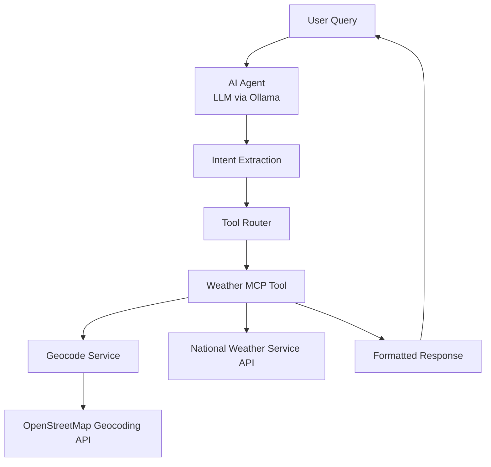
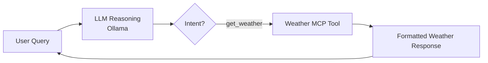
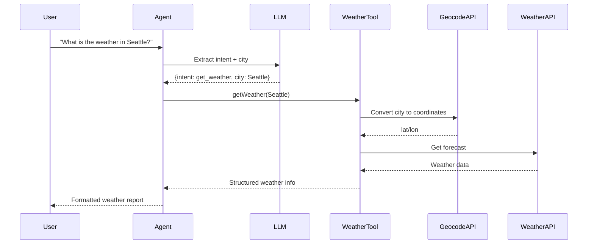

# Agentic AI Weather Assistant using MCP Tool

## Overview

This project demonstrates a simple **Agentic AI system** where an AI agent can understand natural language queries, determine user intent, and delegate the task to an appropriate tool.

The system integrates:

* **Local LLM (LLaMA / Qwen via Ollama)** for natural language understanding
* **MCP-style Weather Tool**
* **National Weather Service API (`api.weather.gov`)**

The AI agent extracts the intent and city from a user query and then calls the weather tool to retrieve real-time weather information.

---

# Architecture

```
User Query
   │
   ▼
AI Agent (LLM via Ollama)
   │
   │ Extract intent + city
   ▼
Tool Router
   │
   ▼
Weather MCP Tool
   │
   ▼
National Weather Service API
   │
   ▼
Formatted Response
```

---

# Key Components

## 1. AI Agent

The AI agent is responsible for:

* Understanding natural language queries
* Extracting structured information (intent + city)
* Delegating the task to the correct MCP tool
* Returning formatted output to the user

Example query:

```
What is the weather in Seattle?
```

The agent extracts:

```json
{
  "intent": "get_weather",
  "city": "Seattle"
}
```

---

## 2. MCP Weather Tool

The MCP tool handles interaction with external APIs.

Responsibilities:

* Convert city → latitude/longitude
* Call the National Weather Service API
* Parse the weather response
* Return structured data to the agent

API used:

https://api.weather.gov/

---

## 3. Local LLM via Ollama

This project uses **Ollama** to run a local LLM model.

Advantages:

* No external API key required
* Runs locally
* Demonstrates real AI-agent reasoning

Supported models include:

* `llama3`
* `qwen3-coder`

---

# Project Structure

```
agentic-weather-mcp
│
├── agent
│   └── weatherAgent.js
│
├── tools
│   └── weatherTool.js
│
├── services
│   └── geocodeService.js
│
├── mcp
│   └── weatherToolSchema.json
│
├── app.js
├── package.json
└── README.md
```

---

# Installation

### 1. Install Node Dependencies

```
npm install
```

---

### 2. Install Ollama

Download from:

https://ollama.com

---

### 3. Pull a Model

Example:

```
ollama pull llama3
```

or

```
ollama pull qwen3-coder
```

Verify:

```
ollama list
```

---

# Running the Application

Start the agent:

```
node app.js
```

Example interaction:

```
Ask a question: What is the weather in New York?
```

Example output:

```
Weather in New York

Temperature: 12°C
Wind: 5 mph
Forecast: Partly Cloudy
```

---

# Agentic Behaviour Demonstrated

| Capability                     | Implementation   |
| ------------------------------ | ---------------- |
| Natural language understanding | LLM via Ollama   |
| Intent detection               | AI Agent         |
| Tool delegation                | Weather MCP Tool |
| External API usage             | weather.gov      |
| Structured response            | Agent formatting |

---

# Example Query Flow

1. User asks:

```
What is the weather in Seattle?
```

2. LLM extracts:

```
intent: get_weather
city: Seattle
```

3. Agent calls:

```
Weather MCP Tool
```

4. Tool retrieves data from:

```
https://api.weather.gov
```

5. Agent formats response.

---

User → Agent → Tool → API → Response

# Future Improvements

Possible enhancements:

* Multi-tool agent architecture
* LLM tool-selection instead of hardcoded routing
* Web UI for chat interface
* Support for additional APIs
* Advanced reasoning queries (e.g. umbrella suggestions)

---

# Architecture Diagrams

## 1. High-Level Agent Architecture



---

# 2. Agent Decision Flow



---

# 3. Sequence Diagram (Full Request Flow)



---

# Conclusion

This project demonstrates a **simple Agentic AI architecture** where an LLM-powered agent can understand user intent and dynamically call external tools to retrieve information.

The system highlights key concepts in modern AI engineering:

* Agent-based workflows
* Tool integration
* LLM reasoning
* External API orchestration
